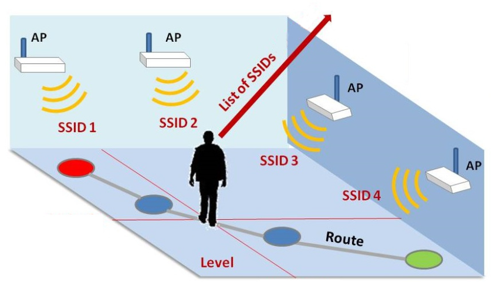
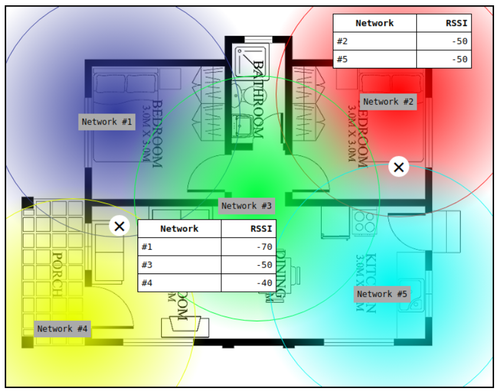
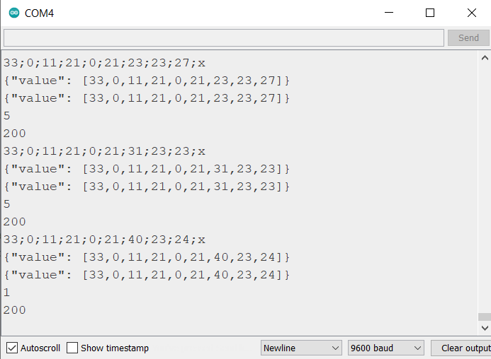
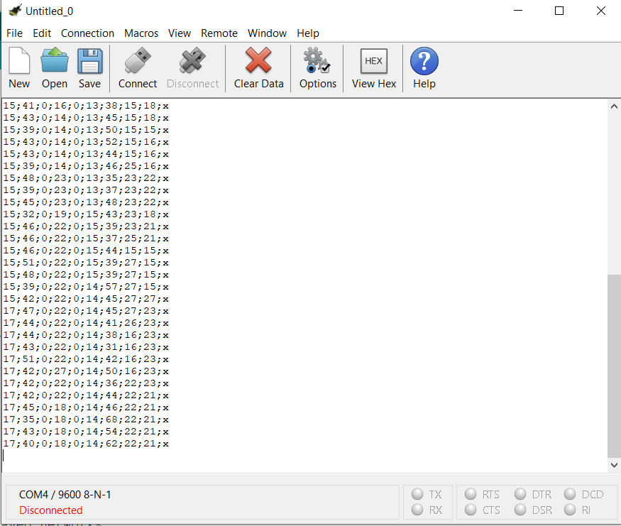
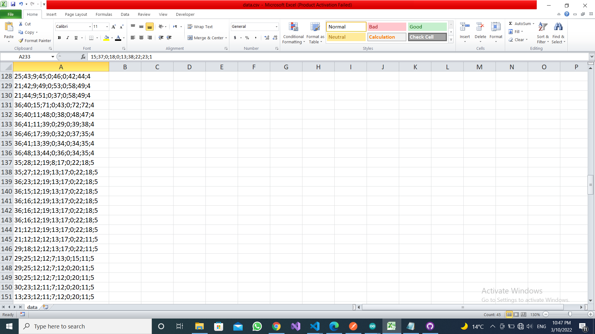
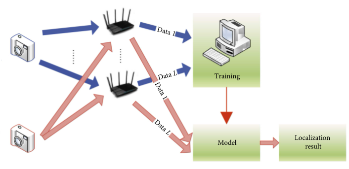
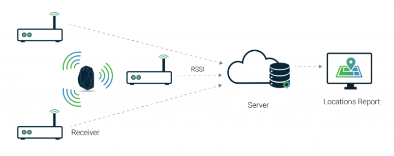
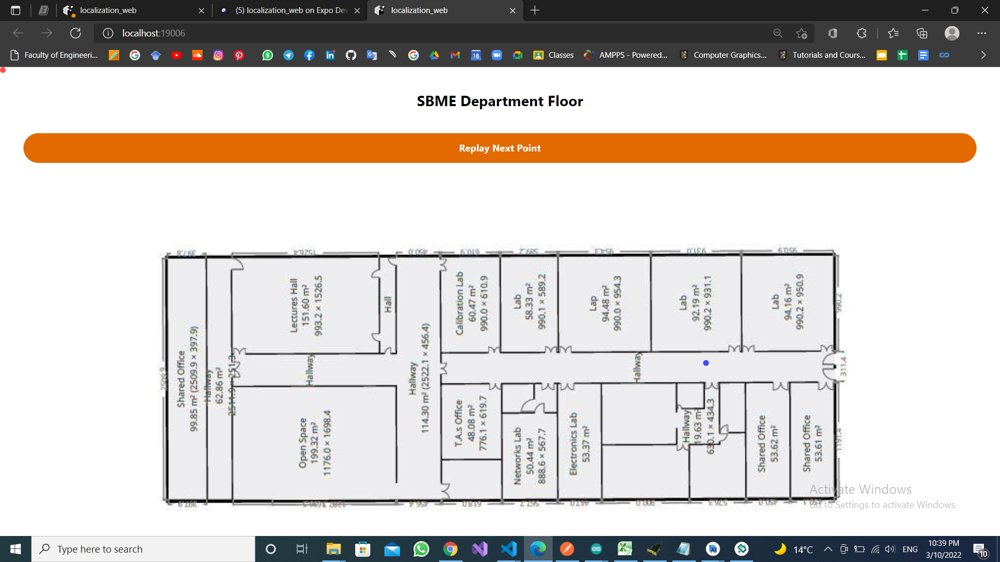
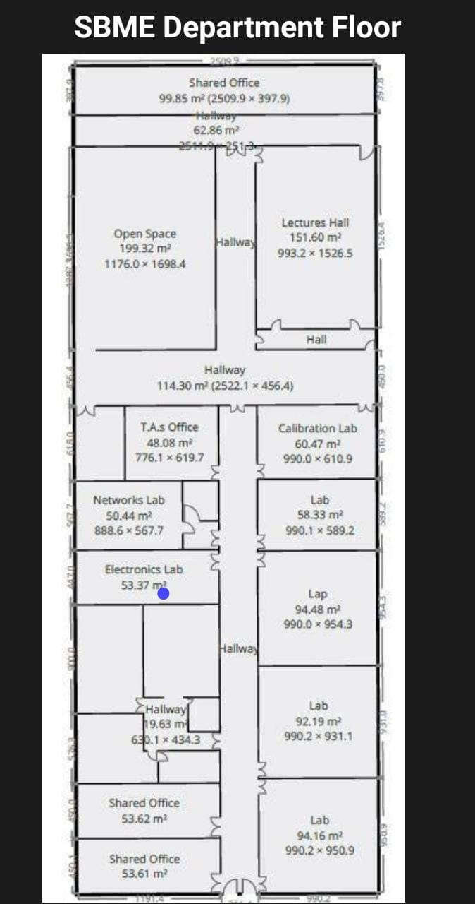

# Indoor-Localization-tracking-System
Design and implementation of a WiFi tracking module where a bracelet can be attached to an object and the user can localize and track the current location of the object in real time through either a mobile application or a website

<p align="center"></p>

-   The features for this project are going to be the RSSIs (Received signal strength indication) of the known WiFi networks. If a network is out of range, it will have an RSSI equal to 0.

## 1. Features definition [📌](https://github.com/Radwa-Saeed/Indoor-Localization-tracking-System/tree/main/Arduino-ESP8266/scan)

- Before actually recording the sample data to train our classifier, we need to do some preliminary work. This is because not all networks will be visible all the time: we have to work, however, with a fixed number of features.

-   First of all we need to enumerate all the networks we will encounter during the inference process.

     To begin, we take a "reconnaissance tour" of the locations we want to predict and log all the networks we detect. Load the following sketch and take note of all the networks that appear on the Serial monitor.
<p align="center"></p>

## 2. Data Acquisition [📌](https://github.com/Radwa-Saeed/Indoor-Localization-tracking-System/tree/main/Arduino-ESP8266/scann-post)

- After selecting our stable networks we start by recording the strengths of those SSIDs by walking randomly and lalbeling each raw of data by its specified room
- Grab some recordings just staying in a location for a few seconds and save the serial output to a file; then move to the next location and repeat: 10-15 samples for each location will suffice.
<p align="center"></p>

<p align="center"></p>

## 3. Convert to features vector [📌](https://github.com/Radwa-Saeed/Indoor-Localization-tracking-System/tree/main/data)

-  The second step is to convert the scan results into a features vector. Each feature will be the RSSI of the given SSID, in the exact order we populated the knownNetworks array.

<p align="center"></p>

## 4. Train and export the classifier [📌](https://github.com/Radwa-Saeed/Indoor-Localization-tracking-System/tree/main/model)
-   We have used The KNeighbors Classifier

<p align="center"></p>


## 5. Creating Flask Server App [📌](https://github.com/Radwa-Saeed/Indoor-Localization-tracking-System/blob/main/app.py)

-   we imported the model.joblib into the server app then the prosess goes as following

    1. The esp scans the SSIDs and Post their RSSIs values in json format to the server through http Request
    2. The server recieve the data and starts to predict the label (location) of the esp

<p align="center"></p>

## 6. Web & Mobile Visualization [📌](https://github.com/Radwa-Saeed/Indoor-Localization-tracking-System/tree/main/Client)

1. We started by connecting the web and mobile Apps to the flask server
2. The server after making the prediction it sends the predicted location label to the apps and they localize the pullet with the specified coordinates

<p align="center"></p>

<p align="center"></p>

## 7. App Features 
- We also added Replay Button which stores the previous locations of the esp and replay them on pressing

## Important Note 
- Make sure to replace the IP address in each file with yours 
- you can find your ipv4 address by the following in your cmd 
```
 >> ipconfig 
```